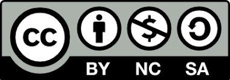

# Release Notes
## Important Notice
This a ​**preliminary**​ report aiming at bringing a first look into the serverless security risks. This report should serve as a base report to the open-call, aiming at creating an official OWASP Serverless Top 10 report based on the industry knowledge and data in the wild.

## Report Structure
Each of the original Top 10 risks is reviewed. The review lists six sections:

A. New possible attack vectors when targeting serverless applications

B. How/Why a serverless application could be vulnerable to such attacks

C. What is the business impact on the cloud account

D. Best practices and suggestions for preventing and mitigating such attacks

E. Example scenario(s), demonstrating a possible vulnerability and exploit

F. Taking into account the attack vectors, weaknesses and impact, as well as the ability to identify and mitigate it; is this security risk higher, lower or the same in serverless applications?

## Request for Comments
- Related vulnerability data to support the project
- Suggestions and votes of what should be listed in the final OWASP Serverless Top 10 project, including any suggested additions not currently on this list
- Suggestion for “How to Prevent” sections
- Any additional ​[internal](https://owasp.org)​ and external references that should be included

## Attributions
Thanks to ​[Protego Labs](https://​protego.io) for sponsoring this report and for everyone else who contributed. Reviewers of this report are mentioned on the ​[Acknowledgements page​](0xae-acknowledgements.md).

Organizations and individuals that will provide vulnerability prevalence data or other assistance will be listed on the acknowledgments page of the official project.

## Copyright and License
 This report is released under the Creative Commons Attribution-ShareAlike 4.0 (CC BY-NC-SA 4.0) International ​[License​](https://creativecommons.org/licenses/by-nc-sa/4.0/) (common to OWASP projects).

