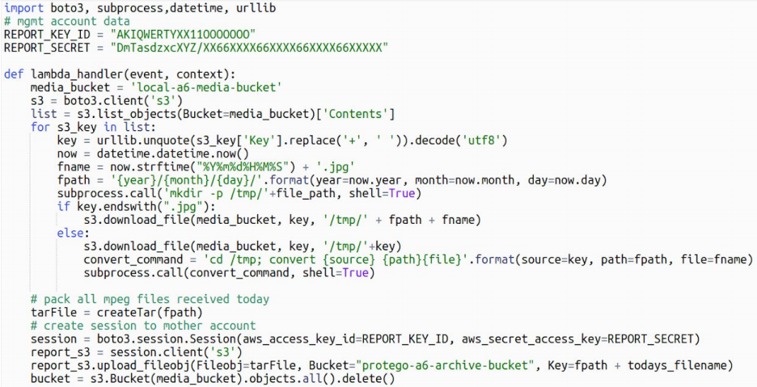
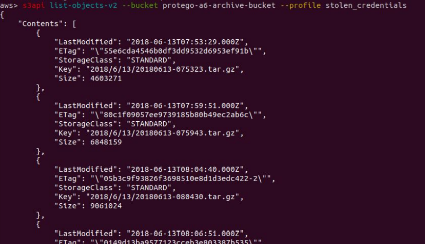

# S3:2017 Sensitive Data Exposure

## Attack Vectors

Sensitive data exposure is as a concern in serverless architecture as in any other architecture. Most of the methods used in traditional architectures, such as stealing keys, performing man-in-the-middle (MitM) attacks and stealing readable data at rest or in transit, still apply to serverless applications. However, the data sources might be different. Instead of stealing data from a server, the attacker can target cloud storage (e.g. S3, Blob) and database tables (e.g. DynamoDB, CosmosDB).

Additionally, leaked keys can lead into unauthenticated and unauthorized actions in the account. There are tools that look for leaked keys in GitHub like KeyNuker, Truffle Hog or even git-secrets by AWS Labs. Moreover, the environment on which the functions run is read-only except to the `/tmp` directory. Attackers can target this folder to look for leftovers from previous executions (refer to: [Insecure Shared Space](0xab-other-risks.md#x-insecure-shared-space)).

Passwords, application logs, hosts, and other files that the attacker used to target belong to the infrastructure now and are less of a concern. On the other hand, you can find the source code of the function as well as the environment variables.

## Security Weakness

Storing sensitive data in plaintext or even using weak cryptography on any storage is extremely common and will likely continue in serverless applications.

In addition, writing data to the `/tmp` directory without deleting it after use, based on the assumption that the container will die after the execution, could lead into sensitive data leakage in case the attacker gains access to the environment.

## Impact

There is no change of impact in case of sensitive data exposure. Sensitive data such as sensitive personal information (PII), health records, credentials and credit cards should be protected, no matter the architecture.

## How to Prevent

- Identify and classify sensitive data
- Minimize storage of sensitive data to only what is absolutely necessary
- Protect data at rest and in transit according to best practices
- Use HTTPS only endpoints for APIs
- Use the infrastructure provider’s services for key management and encryption of stored data, secrets and environment variables (e.g. [AWS Environment variable encryption](https://docs.aws.amazon.com/lambda/latest/dg/env_variables.html#env_encrypt), [Handling Azure secrets](https://david-obrien.net/2016/09/azure-functions-secrets/)) to the functions in runtime and data in transit (e.g. [AWS Key Management Service](https://aws.amazon.com/kms/), [AWS Secrets Manager](https://aws.amazon.com/secrets-manager/), [Azure Key Vault](https://azure.microsoft.com/en-us/services/key-vault/)).

## Example Attack Scenario

A system contains a management application that manages different sub-accounts. To communicate with the management application the function contains hardcoded keys for the management AWS account.

If the attackers gain access to the code via the code repository, access to the runtime environment or by any other means, They can use it to try to access resources that belong to the management account (e.g. using AWS-CLI). For example, listing the above bucket (i.e. protego-S6-archive-bucket).

But could also try to access other resources, depending on the IAM Role associated with the stolen credentials.

