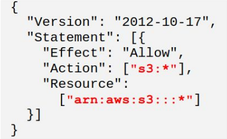
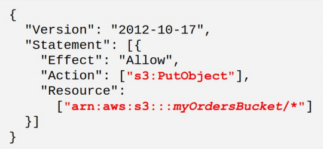

# S5:2017 Broken Access Control

## Attack Vectors

A serverless application can consists hundreds of microservices. Different functions, resources, services and events, all orchestrated together to create a complete system logic. The stateless nature of serverless architecture requires a careful access control configuration for each of the resources, which could be onerous. Attackers will target over-privileged functions in order to gain unauthorized access to resources in the account rather than having control over the environment.

## Security Weakness

In serverless, we do not own the infrastructure, so removing admin/root access to endpoints, servers, network and other accounts (SSH, logs, etc.) is not an issue. Rather, granting functions access to unnecessary resources or excessive permissions on resources is a potential backdoor to the system.

Access control weaknesses are common due to the lack of automated detection and lack of testing by application developers. Organizations that would try any kind of single permission model are prone to fail. Any functions that do not follow the “least privilege” principle are subject to potential broken access control.

## Impact

The impact relies on the compromised resource. Simple cases could lead into data leakage from a cloud storage or a database. More complex scenarios in which a compromised function has permissions to create other resources could end in significant money loss or even full control over resources or the account.

## How to Prevent

- Examine each function carefully and try to follow the "least privilege" principle on each.
- Review each function before delivery to identify excessive permissions.
- It is recommended to automate this process of permission configuration for functions.
- Follow the providers best practices: [AWS IAM Best Practices](https://docs.aws.amazon.com/IAM/latest/UserGuide/best-practices.html), [Azure Identity Management Best Practices](https://docs.microsoft.com/en-us/azure/security/azure-security-identity-management-best-practices), [Google Secure IAM](https://cloud.google.com/iam/docs/using-iam-securely) and [IBM IAM Security](https://www.ibm.com/cloud/garage/architectures/securityArchitecture/security-identity-access-management).

## Example Attack Scenario

A function which is designed to write into an cloud storage, has assigned the following IAM policy, which practically authorizes the function to perform _any_ action on _any_ bucket in the account:

If the function is found vulnerable, an attacker could exploit it to perform unauthorized access, including:

- Unauthorized actions on the specific bucket, such as reading and/or deleting other users orders or uploading unvalidated files.
- Deleting other storages in the account, even outside of the feature/application scope.
- Executing internal functionality, such as executing functions with malicious input which are triggered by events on any of the account cloud storage.
- Denial of Wallet (DoW) via cost-consuming actions like uploading large files in high volumes or consuming high bandwidth with downloads.

To prevent the attack in this scenario, the following IAM role should be assigned to the function. This grants the function the minimal required permissions, which is uploading files (_PutObject_) on a specific storage (_myOrderBucket_):

