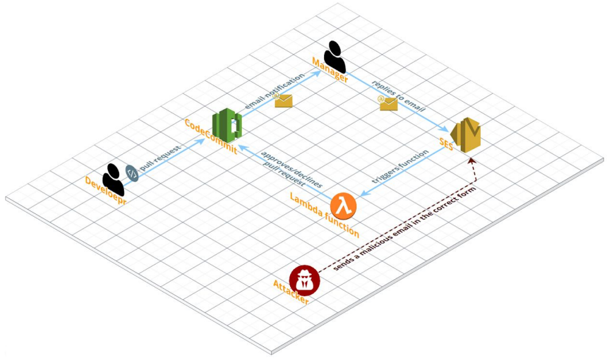

# A2:2017 Broken Authentication

## Attack Vectors

Unlike traditional architectures, serverless functions run in stateless compute containers. This means that there is no one big flow, managed by a server - rather, hundreds of different functions that run separately. Each with a different purpose, triggered from a different event and with no notion of the other moving parts.

Attackers will try to look for a forgotten resource, like a public cloud storage, or open APIs. However, external-facing resources should not be the only concern. If a function is triggered for organizational emails, but attackers can send spoofed emails that will trigger the function, then they can then execute internal functionality without any authentication.

## Security Weakness

Broken authentication is usually a result of poor design of identity and access controls. In serverless architectures, with multiple potential entry points, services, events and triggers and no continuous flow, things can get even more complex.

On the plus side, brute-force and default passwords are less likely to be an issue when using the authentication services provided by the infrastructure.

## Impact

Having access to functions without authentication can lead to sensitive data leakage, but could potentially also lead to breaking the system’s business logic and flow of execution.

## How to Prevent

- Different types of identity and access controls require different types of authentication, depending on the type of access required. If possible, use the available solutions provided by the infrastructure:
  - AWS Cognito or Single Sign-On
  - Azure Active Directory B2C or Azure App Service
  - Google Firebase Authentication or [Auth0](https://auth0.com/docs/integrations/google-cloud-platform)
- External-facing resources should require authentication and access control according to the service provider’s best practices:
  - [API Gateway Access control](https://docs.aws.amazon.com/apigateway/latest/developerguide/apigateway-control-access-to-api.html)
  - [API Management Safeguard](https://www.red-gate.com/simple-talk/cloud/cloud-development/azure-api-management-part-2-safeguarding-your-api/)
  - [OpenAPI authentication](https://cloud.google.com/endpoints/docs/openapi/authenticating-users)
- For service authentication between internal resources, use known secure methods, such as Federated Identity (e.g. SAML, OAuth2, Security Tokens) and make sure to follow security best practices (e.g. encrypted channels, password and key management, client certificate, OTA/2FA).

## Example Attack Scenario

To enable high velocity development, each time a pull request is created the designated manager receives an email message with the relevant information. The manager can than reply to the mail to approve/decline the request. This is done via an SES services that triggers a function with the relevant permissions to approve or close a request. However, if attackers gain knowledge of the email address as well as the required email format, they can sabotage with the development or even inset backdoors into the code by sending a malicious email directly to the designated email address.

